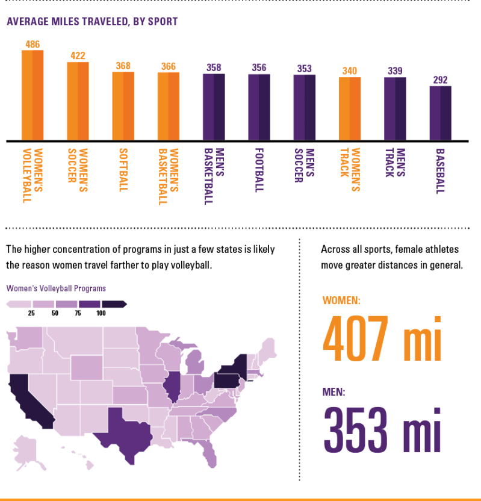

# Data Visualization

a## Assignment 3: Data Visualization Ethics

### Requirements:
- Let’s return to the data visualizations we evaluated for Assignment 2.  
- For each visualization: 
    - Explain (with reference to material covered up to date, along with readings and other scholarly sources, as needed) whether or not you think this data visualization is accessible, reproducible, and equitable. 
        ```
     Good:
     
     https://www.columnfivemedia.com/work/ncsa-how-far-do-college-athletes-travel-to-play/
     

    The visualization is accessible and reproducible and equitable because its using contrasting colours (Purple and Orange) in the bar graph. The bar graph has very good labels, and follows a downwards trend. The graph doesnt just use colour, but also uses the shape and size of the bars to show a downwards trend, and the labels for each bar is easy to ready and identify. The labels and legend are very clear and easy to read. The font size is large and has monospaced text.  The graph is also created using information on NCSA recuiting data and therefore is reproducible. Since the source of the data is linked at the bottom, the access to raw data or detailed data can be used to replicate the diagram. The graph uses men and women athletes showing a diverse group of people and showcases various different sports.

    Bad:

    https://blog.hubspot.com/hs-fs/hubfs/Screen%20Shot%202020-09-02%20at%2010.25.56%20PM.png?width=2250&name=Screen%20Shot%202020-09-02%20at%2010.25.56%20PM.png

    This data visualization is not accessible, reproducible, equitable because the colors being used are very pale, and there is no contrast between the colours. If converted to black and white, it could be hard to see. The box by the title is the same colour of the first bar, which can show a connection, however if in black and white, it may not be idenitifiable. Also there are no proper labels, y-axis does not have a label, therefore we cannot interpret if the each month (x-axis) is good or bad. There is no legend , or title of what this data represent. The main title "my first dataset" is misleading, because how can one have a first dataset for multiple months? We cannot clearly indicate what this visualization is about. Furthermore, this data not reproducible because there is no source, we cannot get to the raw data to reproduce this visualization, and since it lacks legends and labels, we do not know what each colour represents and therefore this is not equitable. 


        ```
    - How could this data visualization have been improved (in terms of accessibility, reproducibility, equity)?  
        ```
    Good:

    This visualization can be imporved because there are other graphs associated with the main bar graph, such as the states and the coloring of the states. It would be hard to see if that part of the visualization was in black and white. The main bar graph has labels but there are no labels for some sports (softball, football, baseball). Identifing those sports would be beneficial for accessibility if colours are not clear to see. Additionally it would be beneficial to see athletes with diverse backgrounds, and a comparision between similar sports because the visulzation showcases different mens and womens sports. Comparing similar sports would increase equitability. Even the USA map, it only focueses on women's travel for vollyball and does not compare the programs avaliable for men's vollyball. The inconsistensy in choosing sports representing the emotional appeal for the data visualization, increasing the subjective interpreations and not present the data without bias. 

    Bad:

    The visualization can be improved by adding more contrasting colours, bigger and clear text (the text is small and blurry). Increase in labels and legends would be good to add. To increase reproducibility more information on how the data was collected, source of the data would be helpful. And equity can be improved but taking samples of multiple people. Looking at this bar graph, it may indicate that the person making the chart is sharing their dataset information, but adding multiple people from different backgrounds will be give better insights. The representation of this visualization is very personal and incomplete as it does not give the user the full information on what the graph shows. 


        ```

- Word count should not exceed (as a maximum) 300 words for each visualization. 

### Why am I doing this assignment?:
- This ongoing assignment ensures active participation in the course, and assesses learning outcomes 2 and 3:  
* Apply general design principles to create accessible and equitable data visualizations
* Use data visualization to tell a story

### Rubric:
| Component               | Scoring   | Requirement                                                 |
|-------------------------|-----------|-------------------------------------------------------------|
| Data viz classification and justification | Complete/Incomplete | - Data viz are clearly classified as good or bad<br />- At least three reasons for each classification are provided<br />- Reasoning is supported by course content or scholarly sources |
| Suggested improvements  | Complete/Incomplete | - At least two suggestions for improvement<br />- Suggestions are supported by course content or scholarly sources |

## Submission Information

🚨 **Please review our [Assignment Submission Guide](https://github.com/UofT-DSI/onboarding/blob/main/onboarding_documents/submissions.md)** 🚨 for detailed instructions on how to format, branch, and submit your work. Following these guidelines is crucial for your submissions to be evaluated correctly.

### Submission Parameters:
* Submission Due Date: `HH:MM AM/PM - DD/MM/YYYY`
* The branch name for your repo should be: `assignment-3`
* What to submit for this assignment:
    * This markdown file (assignment_3.md) should be populated and should be the only change in your pull request.
* What the pull request link should look like for this assignment: `https://github.com/<your_github_username>/visualization/pull/<pr_id>`
    * Open a private window in your browser. Copy and paste the link to your pull request into the address bar. Make sure you can see your pull request properly. This helps the technical facilitator and learning support staff review your submission easily.

Checklist:
- [ ] Create a branch called `assignment-3`.
- [ ] Ensure that the repository is public.
- [ ] Review [the PR description guidelines](https://github.com/UofT-DSI/onboarding/blob/main/onboarding_documents/submissions.md#guidelines-for-pull-request-descriptions) and adhere to them.
- [ ] Verify that the link is accessible in a private browser window.

If you encounter any difficulties or have questions, please don't hesitate to reach out to our team via our Slack at `#cohort-3-help`. Our Technical Facilitators and Learning Support staff are here to help you navigate any challenges.
