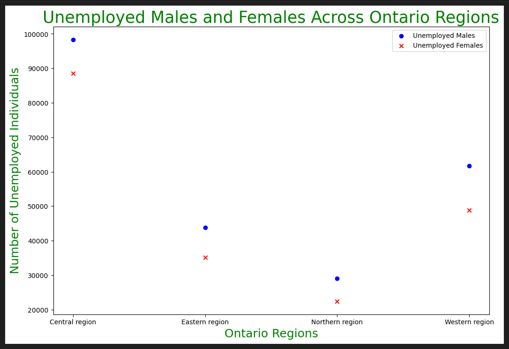
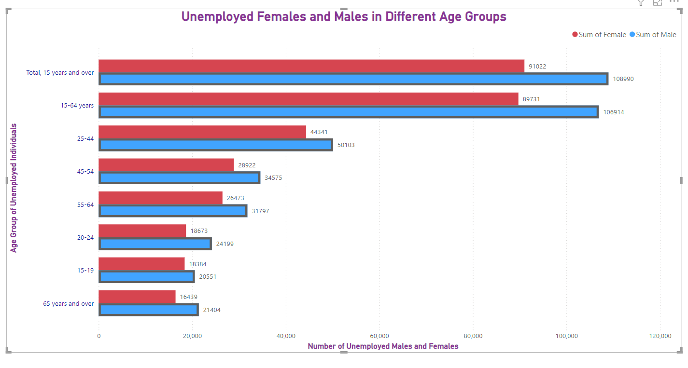

# Data Visualization

## Assignment 4: Final Project

### Requirements:
- We will finish this class by giving you the chance to use what you have learned in a practical context, by creating data visualizations from raw data. 
- Choose a dataset of interest from the [City of Toronto’s Open Data Portal](https://www.toronto.ca/city-government/data-research-maps/open-data/) or [Ontario’s Open Data Catalogue](https://data.ontario.ca/). 
- Using Python and one other data visualization software (Excel or free alternative, Tableau Public, any other tool you prefer), create two distinct visualizations from your dataset of choice.  
- For each visualization, describe and justify: 

    > What software did you use to create your data visualization?
Figure one - I used python to create a scatter plot 

Figure two - I used PowerBI to create a bar graph 

    > Who is your intended audience? 
Intended Audience is Government of Canada for both graphs. 

However figure one would be useful for Service Canada and to manage unemployements rates per region for different sexes (More so for Employment Insurance and programs to assist people to get back into the workforce). This figure could also be useful for the government investing in housing and other programs. 

Figure two would be more focussed on unemployed rates of different age groups, and could aid for EI and Canadian Pension Plans because it focuses on unemployement within different age groups of male and female sexes.

    
    > What information or message are you trying to convey with your visualization?
    
Figure one - The message I am trying to convey is that for every region, the males have a higher unemployment rate for each region than females. All four regions, there is althought central region has the highest unemployment rates for both sexes, the highest difference is within the western region. The scatter plot not only shows the unemployement rates between regions, but also shows the difference between the two sexes per region.

Figure two - The graph shows how unemployment levels for males and females vary across different age groups. This comparison helps to highlight any sex disparities in unemployment for specific age brackets. By looking at the bars for males and females side-by-side, it is clear that the males are unemployed more in every age group. The highest difference is between the 25-44 age group and the lowest difference is between the 15-19 age group.
    
    > What design principles (substantive, perceptual, aesthetic) did you consider when making your visualization? How did you apply these principles? With what elements of your plots? 
Figure one:
Substantive: The data used for both figures came from the same dataset which was collected over 15 years. The accuracy was based on the data collected.Each plot is labeled with M or F and shows the value of the plot, representing the accurate data.

Perceptual: There are labels added for each axis and  title was added. The scatter plots are two different colors and two different designs for easy representation. There is enough spacing between the scatters fo easy data interpretation. There is also a legend on the top for easy interpretation.

Aesthetic: The text of each plot matches the M or F values, indicating the associatation. Its colourful and does not have too many plots, making it hard to see. The distinct markers and colours for males and females make it visually coherent.

Figure two:

Substantive:  The bar graph represents the number of unemployed males and females in different age groups. This graph accurately represents the data and conveys the intended message because the data plotted is collected from the study. To keep accuracy of the data, each bar graph shows annotations, increasing transprancy and accuracy. There is legend used, althought the values are used by adding the sum of numbers for both unemployed males and females, the legend clearly indicates that, additionally providing accuracy. 

Preceptual: THe use of different colours, and outlining the bar for males, shows differentiation between two categories as well as visually separating and comparing the data points for males and females. In the bar graph, bars for males and females are placed side-by-side within each age group to facilitate easy comparison. The spacing between bars helps to avoid visual clutter and overlap, making it easier to interpret the differences. The labels are clear and easy to read. 

Aesthetic: The bar graph uses a simple color scheme with clear, readable labels and legends. Annotations are placed thoughtfully to ensure they are clear but do not clutter the visualization.

I applied the principals in both graphs by using similar colours throughout both visualizations for males and females to keep the information connected. I tried to make sure that I made a legend for each graph, and provided anotations. I used different colours for each sex for each graph and added a legend and annotations. The annotations increase accuracy and transparency of data. For each visualization, to increase asthetic , the title, and axis labels were the same colour to creat visual appeal. 
    
    > How did you ensure that your data visualizations are reproducible? If the tool you used to make your data visualization is not reproducible, how will this impact your data visualization?

Figure one: 

The data visualizations were created using Python scripts with libraries such as Pandas and Matplotlib. There are clear comments within the code for replication. The same data can be used (publically avaliable data) to create the visualization. If Python script was not avaliable, a similar visualization can created using excel or PowerBI. The data set is the same, and only two features were used to create the visualization. By not using the same tools (Python libraries), you could use seaborn or plotty. The visualization may not be the same, but it will be similar.

Figure two:

TO ensure the visualization is reprodicable, is by providing the data set and link of the dataset (in assignment 4 notebook). This contains the same data, and by using the labels and annotations, the transparency of the values being using allows for the visualization to be replicated. If the labels were note clear or the legend did not state "sum of male" or "sum of female, it would be difficult to replicate the visualzation. Making clear labels 
    
    > How did you ensure that your data visualization is accessible?  

Figure one:
Colour Contrast, Data labels and legend, different plot designs, clear font and font size, annotations.

Figure two:
Colour contract, Bar graph out for males vs females, clear legend and text, annotations.
    
    > Who are the individuals and communities who might be impacted by your visualization?  

Both Figures
- People with disabilities, data analyst and reseachers, decision makers, government officials, individuals affected by the data
    
    > How did you choose which features of your chosen dataset to include or exclude from your visualization? 

Figure one:
Features - Region and sex

I chose these two features because they simplify and reduce complexity. I was able to group the people together to get a visualization. The graph would show which region has the most difference between the sexes and the differences between the regions. It would allow for researches and governments to investigate what factors in each regions are contributing to numbers. Adding too many features would complicate things and make it difficult to understand. By plotting two features, we are able to narrow the search down and compare information correctly.

Figure two:
Features - Age groups and Sex

The reason I chose these two feature is because I wanted to keep the one feature from figure one the same, and plot against another feature for more exploratory data, while keeping the plot simple. I wanted to ensure data accuracy and focus identitfy what relationships can be seen. 

To further explore this dataset, the next steps would be to explore the Central region data for the 25-44 age group as these two are the highest in numbers. 
    
    > What ‘underwater labour’ contributed to your final data visualization product?
I had to explore the data to see which factors could be grouped together, and cleaned the data accordingly. I did an exploratory analysis to understand that the difference in unemployment between sexes can be explored against other features. I hen decided to group and sum the number for comparision of the two sexes and their umemployment date. 

- This assignment is intentionally open-ended - you are free to create static or dynamic data visualizations, maps, or whatever form of data visualization you think best communicates your information to your audience of choice! 
- Total word count should not exceed **(as a maximum) 1000 words** 
 
### Why am I doing this assignment?:  
- This ongoing assignment ensures active participation in the course, and assesses the learning outcomes: 
* Create and customize data visualizations from start to finish in Python
* Apply general design principles to create accessible and equitable data visualizations
* Use data visualization to tell a story  
- This would be a great project to include in your GitHub Portfolio – put in the effort to make it something worthy of showing prospective employers!

### Rubric:

| Component         | Scoring  | Requirement                                                                 |
|-------------------|----------|-----------------------------------------------------------------------------|
| Data Visualizations | Complete/Incomplete | - Data visualizations are distinct from each other - Data visualizations are clearly identified - Different sources/rationales (text with two images of data, if visualizations are labeled) - High-quality visuals (high resolution and clear data) - Data visualizations follow best practices of accessibility |
| Written Explanations | Complete/Incomplete | - All questions from assignment description are answered for each visualization - Explanations are supported by course content or scholarly sources, where needed |
| Code              | Complete/Incomplete | - All code is included as an appendix with your final submissions - Code is clearly commented and reproducible |

## Submission Information

🚨 **Please review our [Assignment Submission Guide](https://github.com/UofT-DSI/onboarding/blob/main/onboarding_documents/submissions.md)** 🚨 for detailed instructions on how to format, branch, and submit your work. Following these guidelines is crucial for your submissions to be evaluated correctly.

### Submission Parameters:
* Submission Due Date: `HH:MM AM/PM - DD/MM/YYYY`
* The branch name for your repo should be: `assignment-4`
* What to submit for this assignment:
    * A folder/directory containing:
        * This file (assignment_4.md)
        * Two data visualizations 
        * Two markdown files for each both visualizations with their written descriptions.
        * Link to your dataset of choice.
        * Complete and commented code as an appendix (for your visualization made with Python, and for the other, if relevant) 
* What the pull request link should look like for this assignment: `https://github.com/<your_github_username>/visualization/pull/<pr_id>`
    * Open a private window in your browser. Copy and paste the link to your pull request into the address bar. Make sure you can see your pull request properly. This helps the technical facilitator and learning support staff review your submission easily.

Checklist:
- [ ] Create a branch called `assignment-4`.
- [ ] Ensure that the repository is public.
- [ ] Review [the PR description guidelines](https://github.com/UofT-DSI/onboarding/blob/main/onboarding_documents/submissions.md#guidelines-for-pull-request-descriptions) and adhere to them.
- [ ] Verify that the link is accessible in a private browser window.

If you encounter any difficulties or have questions, please don't hesitate to reach out to our team via our Slack at `#cohort-3-help`. Our Technical Facilitators and Learning Support staff are here to help you navigate any challenges.
